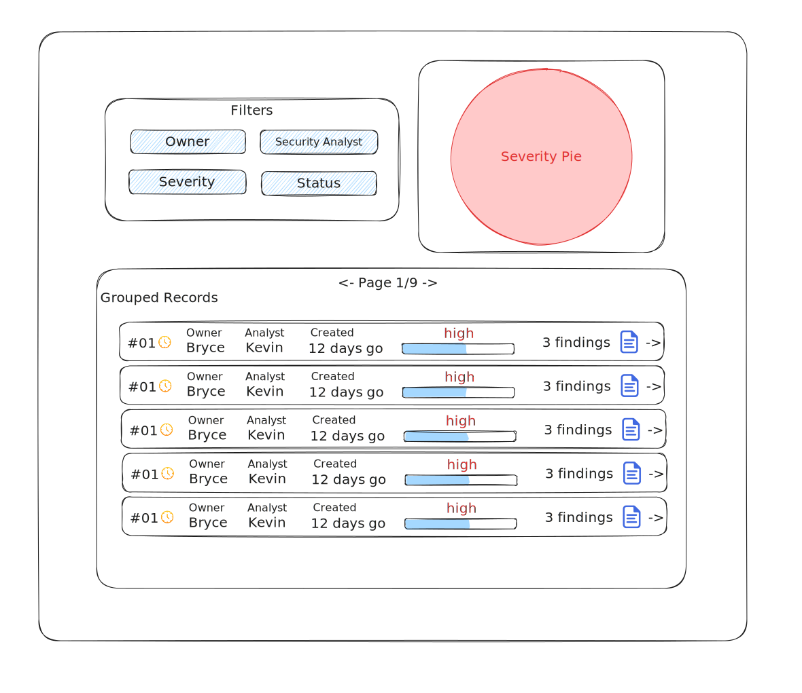

# Burlap

[Bun](https://bun.sh) is the runtime I used instead of node.
```sh
curl -fsSL https://bun.sh/install | bash
```

Then simply

```sh
bun i
bun dev
```

### The Stack


The main nice thing here is that Drizzle, tRPC, React Query, and Typescript all play together very well. It allows for full typesafety from SQLSchema, through tRPC API endpoints, to React Query. Furthermore, React Query is a great experience in function components and hooks for keeping the users options (like which page in a paginated table is selected) consistent with the UI. It supports batching as well, so if one click promps 3 new queries to the backend, they are batched into a single request.

### The Dashboard Plan




### more docs / images to come