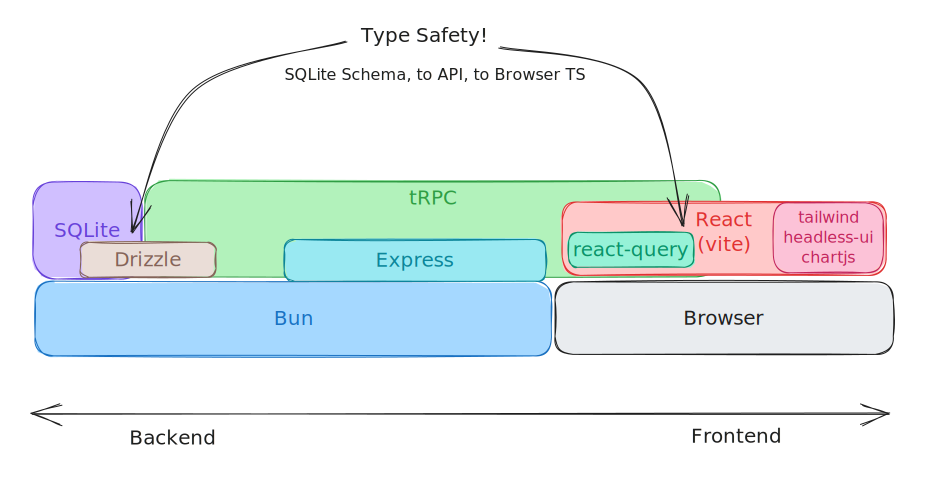
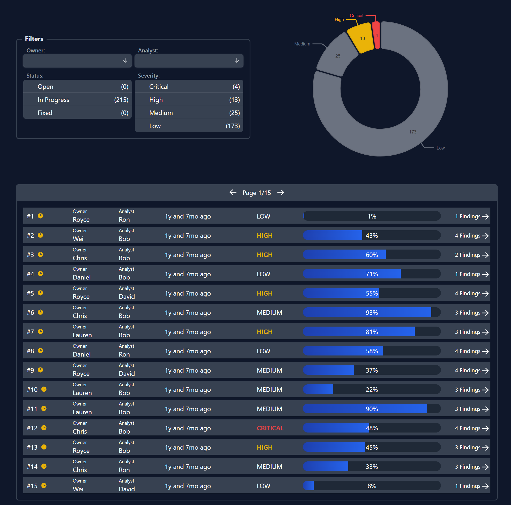

# Burlap

[Bun](https://bun.sh) is the runtime I used instead of node.
```sh
curl -fsSL https://bun.sh/install | bash
```

Then simply

```sh
bun i
bun dev
```

The frontend listens on *localhost:5173*. The backend is on localhost:4000, though you shouldn't need that.

### The Stack



The main nice thing here is that Drizzle, tRPC, React Query, and Typescript all play together very well. It allows for full typesafety from SQLSchema, through tRPC API endpoints, to React Query. Furthermore, React Query is a great experience in function components and hooks for keeping the users options (like which page in a paginated table is selected) consistent with the UI. It supports batching as well, so if one click promps 3 new queries to the backend, they are batched into a single request.

### The Dashboard



Admittedly, I did not focus too much on making a beautiful/snazzy looking UI. I mostly focused on the tooling used to connect everything together, keeping it more technically simple to extend and scale.

In general, I tend to focus on the mechanical aspect of the page, and less about design. Having a UI/UX Designer on my team is a great force-multiplier for me!

